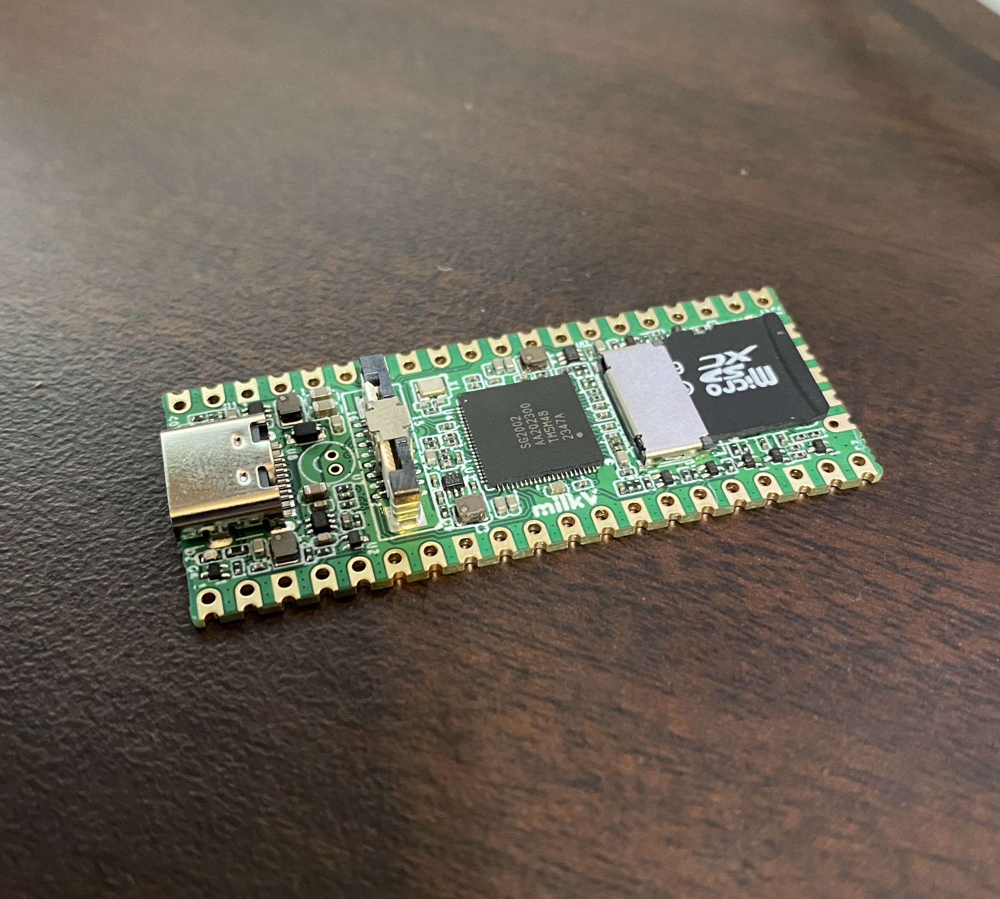
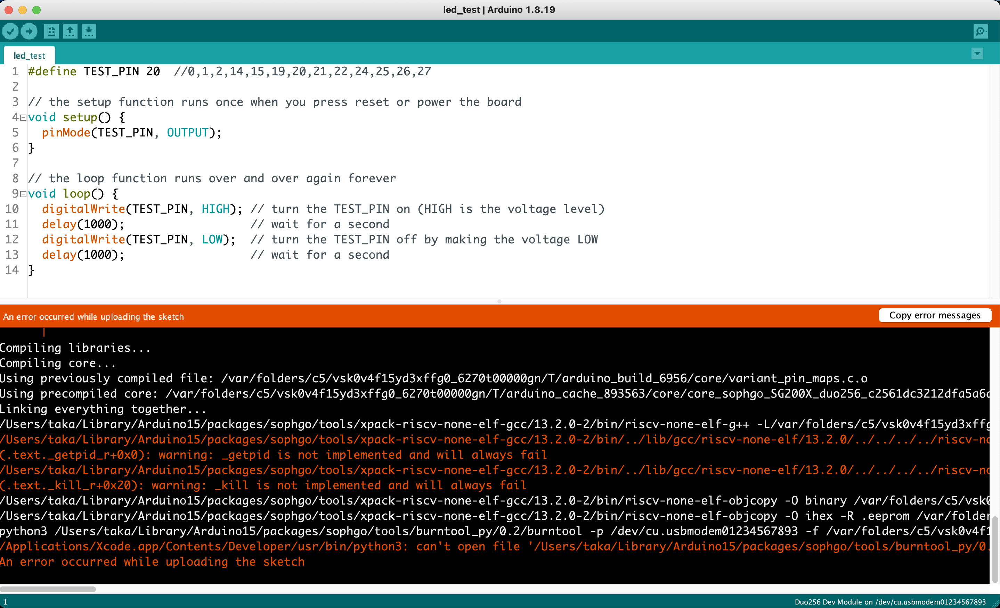
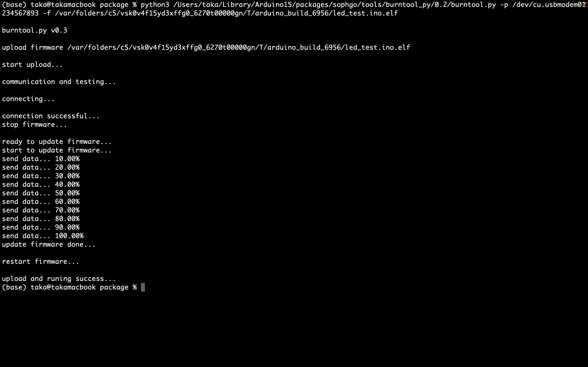

# milkVでArduinoを動かす

ここでは、milkVのセットアップからArduino IDEでプログラムを書き込むまでの手順を示す。

------
# 環境
- Mac Book Pro 2022
- M2
- RAM16GB
- MacOS Monterey 12.5.1
------
# 準備するもの
- milkV DUO 256M
- microSDカード
- USB-Cケーブル
------
# 1. milkVでArduinoを動かす準備
### microSDカードにイメージを書き込み
以下のURLを参照。

[Boot Duo from microSD card (milkv公式)](https://milkv.io/docs/duo/getting-started/boot)

書き込む際はbalenaEtcherを利用した。

#### インストールするイメージの注意点

インストールするイメージがArduinoに対応しているか確認する必要がある。

各バージョンの説明文を読み、Arduinoに対応しているものを選ぶ必要あり（対応しているもののファイル名にarduinoとついているものを選ぶ）
2024/6/24時点でArduinoに対応したものは`Duo-V1.0.9`であるため、それを使用しました。

[duo-build-SDK](https://github.com/milkv-duo/duo-buildroot-sdk/releases/)

そのため、`arduino-milkv-duo-v1.0.9-2024-0228.img.zip`または`arduino-milkv-duo256m-v1.0.9-2024-0228.img.zip`のどちらかを対応するハードウェアに合わせてインストールする。

今回は、`arduino-milkv-duo256m-v1.0.9-2024-0228.img.zip`を使用しました。

### microSDカードスロットに差し込む

microSDを差し込んだ様子



------
# 2. Arduino IDE側のセットアップ
以下のURLを参考にArduino IDEを設定する。

[Introduction](https://milkv.io/ja/docs/duo/getting-started/arduino)

> JSONファイルに関して、現時点最新のv0.2.4の`https://github.com/milkv-duo/duo-arduino/releases/download/v0.2.4/package_sg200x_index.json`の使用を推奨する

------
# 3. milkvへの書き込み
### PCとmilkVを接続する

電源供給がされ、赤いLEDが点灯した後に青いLEDが点灯したらmilkVの起動したということになります。（青LED点灯まで2,3分ほどかかります）


### Arduino IDEからプログラムを書き込む。

プログラムを書き込む際も、以下のURL通りに行う。

[Introduction](https://milkv.io/ja/docs/duo/getting-started/arduino)

ただ、当時macOSにおいて書き込み時のエラーが起こったため以下に示す。

#### macOSで書き込む上での注意点

> すでにtofunologyメンバーがこの解決方法をPR出しました。
> [v0.2.4](https://github.com/milkv-duo/duo-arduino/releases/tag/v0.2.4)のリリースにて解決済み

使用した`arduino-milkv-duo256m-v1.0.9-2024-0228.img.zip`では、Arduino IDEのビルド時にエラーが出てしまう。エラー内容は以下の通り。

```sh
python3 /Users/username/Library/Arduino15/packages/sophgo/tools/burntool_py/0.2/burntool -p /dev/cu.usbmodem01234567893 -f /var/folders/c5/vsk0v4f15yd3xffg0_6270t00000gn/T/arduino_build_2526/micros_test.ino.elf 
/Applications/Xcode.app/Contents/Developer/usr/bin/python3: can't open file '/Users/username/Library/Arduino15/packages/sophgo/tools/burntool_py/0.2/burntool': [Errno 2] No such file or directory
An error occurred while uploading the sketch
```



上記のエラー内に`burntool`とありますが、これが正しくは`burntool.py`であり起こるエラーだと考えられます。

#### 解決策

Arduino IDEでビルドした後に、エラー文で出たコマンド(burntool.pyになっていないコマンド)をコピーし、`.py` を付けてターミナル上でコマンドを打ち込み書き込む

自分の環境では、以下のように実行させることによって書き込みを行うことができました。

```sh
python3 /Users/username/Library/Arduino15/packages/sophgo/tools/burntool_py/0.2/burntool.py -p /dev/cu.usbmodem01234567893 -f 
```



このように書き込みが完了する。

