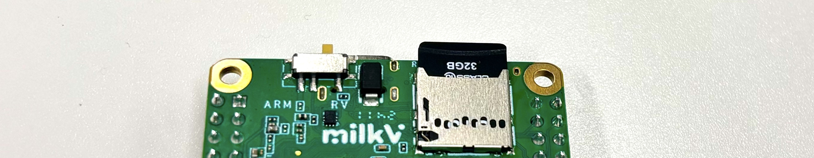
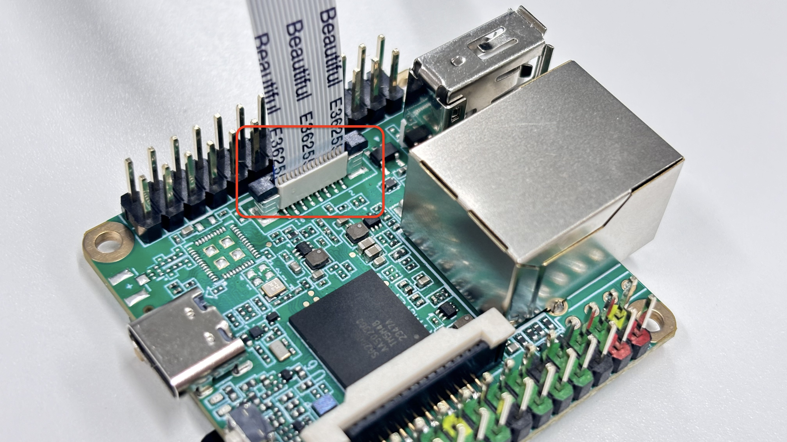
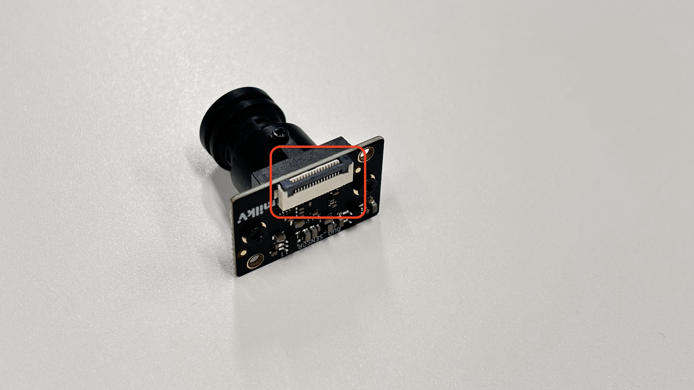
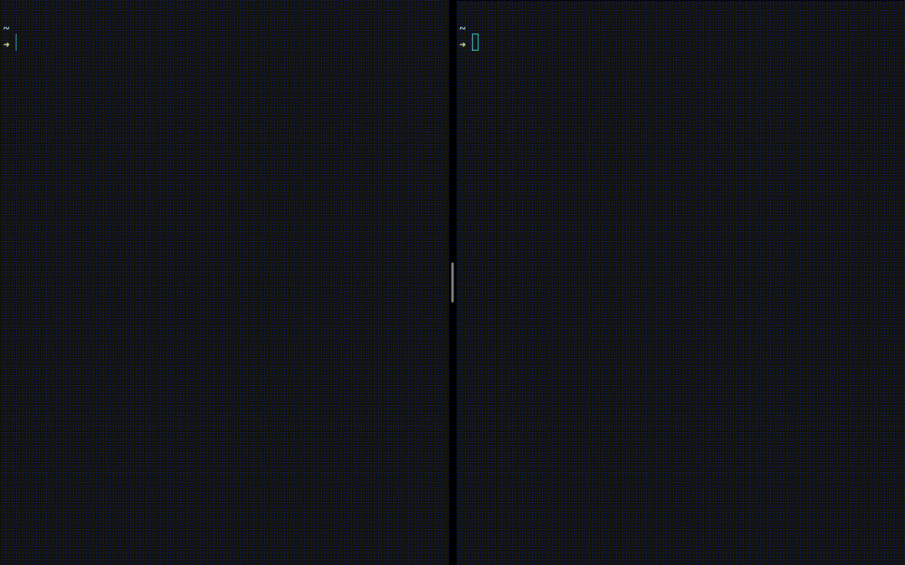
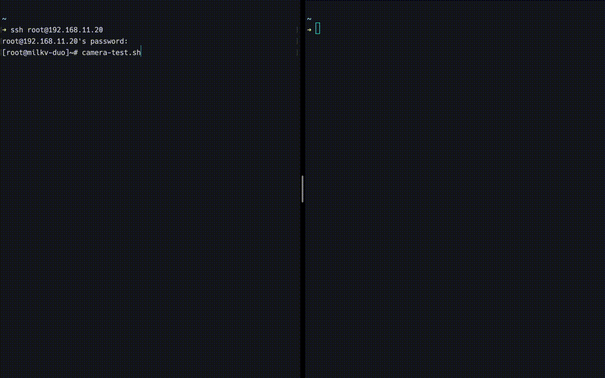
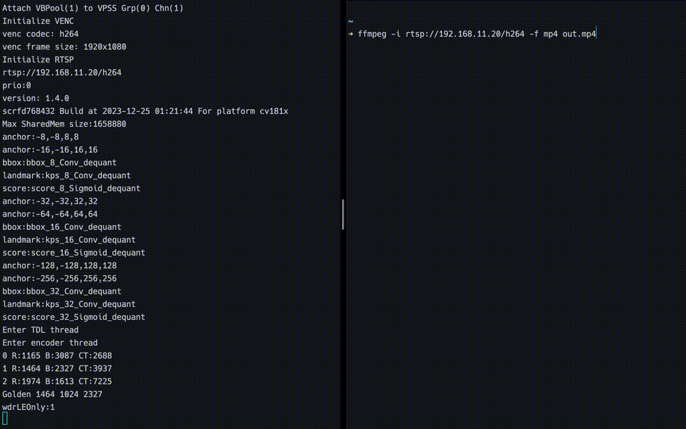

# Duo-Sでカメラを使う
------
# 筆者の環境
- Mac Book Pro 2020
- 1.4 GHz クアッドコアIntel Core i5
- RAM16GB
- MacOS Sonoma 14.5（23F79）
------
# 使用しているDuo-Sについて
無線付きは国内NGでしたので，無線部分を取り除いたverをいただきました．


#### 参考資料
- [https://milkv.io/ja/duo-s](https://milkv.io/ja/duo-s)
- [https://milkv.io/docs/duo/getting-started/duos](https://milkv.io/docs/duo/getting-started/duos)

# 使用しているカメラについて
`CAM-GC2083`を使用しています．
#### 参考資料
- [https://milkv.io/ja/docs/duo/camera/gc2083](https://milkv.io/ja/docs/duo/camera/gc2083)
------
# 1. Duo-SでLinuxを動かす準備
### RISC-Vマイコンを使用する


[https://milkv.io/docs/duo/getting-started/duos](https://milkv.io/docs/duo/getting-started/duos)より引用

### SDカードにLinuxを書き込み
基本的には[ここ](https://milkv.io/docs/duo/getting-started/boot)に従う．

[https://github.com/milkv-duo/duo-buildroot-sdk/releases/tag/Duo-V1.1.1](https://github.com/milkv-duo/duo-buildroot-sdk/releases/tag/Duo-V1.1.1)の`milkv-duos-sd-v1.1.1-2024-0528.img.zip`を使用した．

書き込む際は[Burn image](https://milkv.io/docs/duo/getting-started/boot#burn-image)に従って，balenaEtcherを利用した．

### SDカードスロットに差し込む


# 2. カメラをDuo-Sに差し込む
### Duo-S側
黒い爪部分を両端とも上方向に外して，ケーブルを差し込む

### カメラ側
黒い爪部分を両端とも上方向に外して，ケーブルを差し込む


### 完了


# 3. Linuxの立ち上げ
### 有線LANとtypeCを接続する
LAN部分にはCAT5eのケーブルを使用．
TypeC端子には[Anker Nano II 65W (PD 充電器 USB-C)](https://www.ankerjapan.com/products/a2663)から伸ばしたTypeCケーブルを接続．

### LEDの点滅を確認


# 4. Linuxへのログイン
### IPアドレスを調べる
Macユーザの私はLanScanというアプリで確認しました．
私の場合，`192.168.11.20`であることがわかりました．

### sshで接続
```sh
ssh root@192.168.11.20
```
何か聞かれたら`yes`でOK．
ログインパスワードは`milkv`．


# 5. カメラ立ち上げ
以下のコマンドで`rtsp://[ipアドレス]/h264`にRTSPサーバが建てられます．
私の場合は`rtsp://192.168.11.20/h264`でした．
```sh
camera-test.sh
```



# 6-A. FFMPEGでrtspサーバへアクセスして動画を見る

ffplayコマンドを使うと別ウィンドウでカメラ映像が立ち上がります．
```sh
ffplay rtsp://192.168.11.20/h264
```


#### 動作の様子
<div><video controls src="./fig/demo_show_movie.mp4" muted="false"></video></div>

# 6-B.  FFMPEGでrtspサーバへアクセスして動画を録画する

`out.mp4`というファイル名で保存されます．
```sh
ffmpeg -i rtsp://192.168.11.20/h264 -f mp4 out.mp4
```


#### 実際の動作の様子
一部パケットロスが起きてしまっている模様．
通信性能に合わせて動画サイズをスケーリングできると良さそうですね．
<div><video controls src="./fig/demo-out.mp4" muted="false"></video></div>

